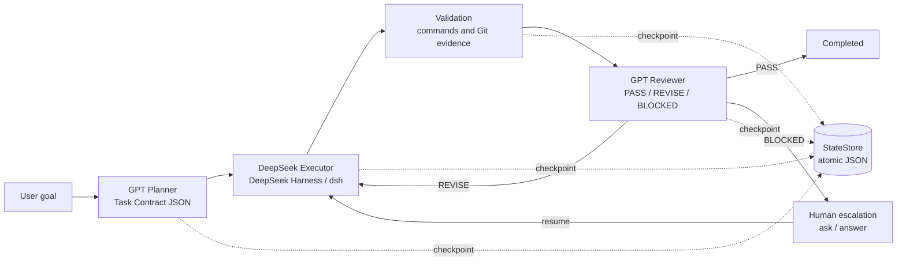

# GPT-DeepSeek V1 Orchestrator

GPT-DeepSeek V1 Orchestrator is an **autonomous coding workflow system** for Git repositories. It turns a natural-language goal into a structured task contract, asks a DeepSeek Harness session to carry out the work, validates the resulting workspace, and sends the evidence to a GPT-compatible reviewer. The workflow can retry a revision, persist its state, resume after an interruption, or pause for a human decision.

## Architecture



The planner and reviewer use an OpenAI-compatible `POST /chat/completions` endpoint. The executor invokes the installed `dsh` command in the target Git workspace. Every phase transition is written atomically to one JSON file under `.orchestrator/`; the observed DeepSeek session identity is retained for a later resume.

## Implemented V1 capabilities

- Structured `TaskContract` planning with goal interpretation, scope, non-goals, an implementation plan, acceptance criteria, validation requirements, allowed paths, and risk notes.
- GPT-compatible planner and reviewer adapters with JSON parsing and verdict validation.
- DeepSeek Harness headless execution with bounded subprocess handling, redacted evidence, and session-aware continuation.
- Validation evidence containing project validation command results (when supplied by the contract) and Git status/diff information.
- Workspace and path boundary checks, Git baseline capture, and secret redaction in provider output.
- Automated `PASS`/`REVISE`/`BLOCKED` review loop with a configurable iteration limit.
- Atomic task-state persistence and resume without re-planning a saved contract.
- Human escalation through durable `ask` and `answer` commands.
- Deterministic `FakeAdapter` mode for offline smoke tests and integration tests.

## Installation

Requirements:

- Python 3.10 or newer
- Git
- A configured OpenAI-compatible provider for planning and review
- The DeepSeek Harness CLI (`dsh`) on `PATH` for real execution

Clone the repository and its pinned upstream submodules, create a virtual environment, and install the package:

```bash
git clone --recurse-submodules https://github.com/a176073240-cmd/gpt-deepseek-v1-orchestrator.git
cd gpt-deepseek-v1-orchestrator
python -m venv .venv
```

Activate the environment using the command for your shell, then install the local package:

```bash
# macOS/Linux
source .venv/bin/activate

# Windows PowerShell
# .venv\Scripts\Activate.ps1

python -m pip install --upgrade pip
python -m pip install -e .
```

The project has no mandatory third-party Python runtime dependencies. Install and configure `dsh` separately according to the [DeepSeek Harness documentation](https://github.com/deepseek-ai/deepseek-harness).

## Configuration

Copy the example file to a local, ignored environment file and fill in values for your providers:

```bash
cp .env.example .env
```

The CLI reads environment variables; it does not load `.env` automatically. Use your shell, a secrets manager, or a dotenv tool to export the values before invoking the command. Never commit `.env` or put credentials in source, task contracts, state files, or logs.

| Variable | Required | Description |
| --- | --- | --- |
| `GPT_API_KEY` | Yes | API key for the OpenAI-compatible planner/reviewer endpoint. |
| `GPT_API_BASE` | Yes | Provider base URL, or the full `/chat/completions` URL. |
| `GPT_MODEL` | Yes | Model name used by both planner and reviewer. |
| `DEEPSEEK_API_KEY` | Yes for real runs | Key consumed by the DeepSeek Harness environment. |
| `DEEPSEEK_API_BASE` | Yes for real runs | DeepSeek provider base URL; the adapter also maps it to `DEEPSEEK_BASE_URL` when needed by `dsh`. |
| `DEEPSEEK_MODEL` | Provider-dependent | Model name made available to `dsh`. |
| `MAX_REVIEW_ITERATIONS` | No | Maximum automatic review/repair iterations; defaults to `3`. |

Provider requests use the configured API key only in the process environment and redact matching secret values from saved execution evidence. Keep state and runtime directories private even when they are ignored by Git.

## Usage

Run a real task against an existing Git repository:

```bash
orchestrator run "Add a CSV export while preserving the existing behavior" \
  --workspace /path/to/target-repository \
  --state-dir .orchestrator \
  --max-iterations 3 \
  --json
```

The command creates a task ID and advances through planning, execution, validation, and review. The JSON result contains the task contract, phase, execution reports, validation results, Git evidence, reviewer feedback, and (when available) the DeepSeek session ID. A non-zero exit code means the task did not reach `COMPLETED`.

For an offline deterministic smoke test that does not call a provider:

```bash
orchestrator run "Inspect this fixture" --workspace /path/to/git-fixture --fake --json
```

Use the root shim instead when the package is not installed:

```bash
python orchestrator.py run "Inspect this fixture" --workspace /path/to/git-fixture --fake --json
```

Inspect a saved task:

```bash
orchestrator status TASK_ID --state-dir .orchestrator --json
```

## Resume and human escalation

The state file is updated after each phase. If the process exits during execution or validation, start a new process and resume the saved task by ID. The workspace is recorded in the state, so the same checkout should be available:

```bash
orchestrator resume TASK_ID --state-dir .orchestrator --json
```

When a policy choice or required configuration needs a person, persist a question:

```bash
orchestrator ask TASK_ID "Which compatibility policy should the executor use?" \
  --context "Two existing formats are present." \
  --state-dir .orchestrator --json
```

Record the answer using the returned question ID, then resume:

```bash
orchestrator answer TASK_ID "Keep the existing format and add the new one." \
  --question-id QUESTION_ID \
  --state-dir .orchestrator --json
orchestrator resume TASK_ID --state-dir .orchestrator --json
```

The answer and prior evidence remain in the persisted state. A saved task contract is reused; the workflow does not plan the task again during resume.

## Development and tests

Run the deterministic test suite from the repository root:

```bash
python -m pytest
python -m compileall -q src orchestrator.py
```

The test suite exercises contract parsing, redaction and path boundaries, DeepSeek command/session handling, review repair, persistence/resume, and human escalation. Tests use temporary Git fixtures and do not require API keys or a live `dsh` installation.

## Limitations

- Real provider validation requires valid credentials, network access, and a compatible `dsh` installation; the repository does not bundle model weights or provider services.
- The workflow operates on one Git workspace at a time and intentionally keeps the V1 planner/executor/reviewer architecture small. It does not provide local Qwen models, model routing, multi-agent scheduling, or a web UI.
- The executor is provider-controlled. Review and path checks provide evidence and guardrails, but they cannot guarantee that an external model will produce a useful change for every goal.
- State files and runtime output are local operational data. They are ignored by Git, but operators should still protect them from unauthorized access and remove old runs when appropriate.
- Planner-supplied validation commands must be appropriate for the target repository and may fail when required tools are unavailable.

## Upstream components

The checkout records pinned submodule references for:

- [Augani/agent-orchestrator](https://github.com/Augani/agent-orchestrator)
- [deepseek-ai/deepseek-harness](https://github.com/deepseek-ai/deepseek-harness)

See [CONTRIBUTING.md](CONTRIBUTING.md) for development conventions and pull request guidance. This project is released under the [Apache License 2.0](LICENSE).
